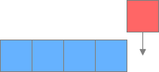
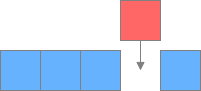
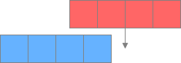
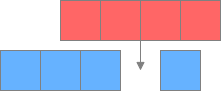
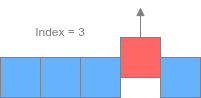
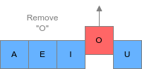
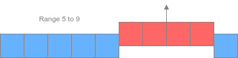

# ArrayList

`ArrayList` is the most widely used implementation of the `List` interface. Some of the salient features of an `ArrayList` are:

1. Elements are stored in the order of insertion.
2. It allows the storage of duplicate elements.
3. ArrayList also supports null elements.

## Internal implementation of ArrayList

An `ArrayList` stores data in a resizable array. When an `ArrayList` is created, an array of size **zero** is created. Only when the first element is inserted does the array size change to ten. This is called ***lazy initialization***, and it saves a lot of memory.

Before adding an element in `ArrayList`, its capacity is checked. If the internal array is full, then a new array of size `n + (n / 2) + 1` is created (e.g., if the capacity is ten, then a new array of size 16 will be created). The elements from the old array will be copied to the new array. This increases the capacity of an `ArrayList`, which is a time-consuming process.

## Time complexities for ArrayList operations

### Adding an element
Since an array backs an `ArrayList`, the addition of an element takes `O(1)` time in most of the cases. It will take more time if the `ArrayList` is full and needs to be resized. In that scenario, a new array will be created, and elements will be copied from the old array to the new array.

### Removing an element
The remove operation has `O(n)` complexity in the worst case and `O(1)` in the best case. There are two overloaded versions of the `remove()` method in `ArrayList`:
1. The first one takes the index of the element that needs to be removed as input. The element can be found in `O(1)` time using the index, but when the element is removed, the other elements need to be moved to the left. So, if the last element is removed the complexity will be `O(1)` otherwise, `O(n)`.

2. In the second case, the `remove()` method takes the element that needs to be removed as input. The array is scanned from the beginning to find the first occurrence of that element, and then it is removed. This has a complexity of `O(n)`.

### Fetching an element
Fetching an element from an array using an index is `O(1)` constant-time operation. So, fetching an element from an `ArrayList` takes constant time.

## Creating an ArrayList
There are three ways to create an ArrayList:

### Using the no-arg constructor
The default constructor does not take any argument and creates a `List` of size zero. Below is the syntax to create `ArrayList` using the default constructor.

```java
List list = new ArrayList();
```

### Using the constructor that takes initial capacity
We can also provide an initial capacity while creating an `ArrayList`. The benefit is that if we know that our `ArrayList` will contain a minimum of 100 elements, then we can create the `ArrayList` with a size of 100. Thus, our `ArrayList` will not require frequent resizing.

```java
List list = new ArrayList(100);
```

### Using existing Collection
An `ArrayList` can also be created using an existing `Collection`. The newly created ArrayList will contain all the elements in the same order in the original collection.

```java
List list = new ArrayList(oldList);
```

## ArrayList: Inserting and Retrieving Elements

### Inserting a single element at the end
To add a single element at the end of the List, the `add(E e)` method can be used, where `E` refers to any type of object. This method will check if there is sufficient capacity in the `ArrayList`. If the `ArrayList` is full, then it will resize it and insert the element at the end.



### Inserting a single element at a given index
We can also insert an element at a particular index using the `add(int index, E element)` method. This method will insert the element at the given index and will shift the element currently at that position (if any) and any subsequent elements to the right. This method will throw `IndexOutOfBoundsException` if the provided index is less than zero or greater than the size of `ArrayList`.



### Inserting multiple elements from another `Collection`
If we have a `Collection` and we need to add all its elements to another `ArrayList`, then the `addAll(Collection c)` method can be used. This method will add all the elements at the end of the `ArrayList`.

```java
list.addAll(anotherList)
```



### Inserting multiple elements from another Collection at a particular index
If we have a `Collection` and need to add all its elements to another `ArrayList` at a particular index, then the `addAll(int index, Collection c)` method can be used. This method inserts all of the specified collection elements into this list, starting at the specified position. It also shifts the element currently at that position (if any) and any subsequent elements to the right.

```java
list.addAll(3, anotherList)
```



```java
import java.util.ArrayList;
import java.util.List;

public class ArrayListDemo {

	public static void main(String args[]) {
		List list = new ArrayList();
		list.add(1);
		list.add(2);
		list.add(3);
		System.out.println(list);

		list.add(4);  // This will add 4 at the end of the List.
		System.out.println(list);

		list.add(1, 50); // This will add 50 at index 1. All the other elements will be shifted to right.
		System.out.println(list);

		List newList = new ArrayList(); // Creating a new List which will be added to original list.
		newList.add(150);
		newList.add(160);

		list.addAll(newList); // This will add all the elements present in newList to list.
		System.out.println(list);
	}
}
```

In the above example, you must have encountered a warning message stating, “`ArrayListDemo.java uses unchecked or unsafe operations`”. The reason for this is that our `ArrayList` is of ***raw*** type, meaning that while creating the `ArrayList`, we did not define what type of elements this `ArrayList` can hold. If we had defined the type of elements it can hold when we created the `ArrayList`, then it is called a **parameterized type**. It can be done as shown below.

```java
List<String> list = new ArrayList<>();
```

So, we need to provide the type of object within `<>` while creating the list.


### Fetching elements from an ArrayList
To fetch an element from `ArrayList`, we can use the `get(int index)` method. This method takes an `index` as input and returns the element at that `index`. The `index` provided should be equal or greater than zero and should be less than `ArrayList` size.

We can fetch the size of the `ArrayList` using the `size()` method.

```java
import java.util.ArrayList;
import java.util.List;

public class ArrayListDemo {

	public static void main(String args[]) {
		List<Integer> list = new ArrayList<>();
		list.add(1);
		list.add(2);
		list.add(3);
		System.out.println(list);

		System.out.println("The element at index two is " + list.get(1));

		System.out.println("The size of the List is  " + list.size());

	}
}
```

## ArrayList: Operations

### Removing an element at a particular index
We can use the `remove(int index)` method to remove an element at a particular index. The index should be less than the size of `ArrayList`, otherwise, `IndexOutOfBoundsException` is thrown.



### Removing a particular element from the ArrayList
We can also specify the element that we want to remove using the `remove(Object o)` method, and the first occurrence of that element will be removed.



### Removing all the elements within a range
Let’s suppose we need to remove all the elements from index 5 to 9. This can be done using the `removeRange(int fromIndex, int toIndex)` method. This method will remove, from this list, all of the elements whose index is between *fromIndex*, inclusive, and *toIndex*, exclusive. Please note that this method is not defined in the `List` class. So, it can be used only when the reference type is also `ArrayList` and not `List`.



### Removing all the elements within a given Collection
We can use the `removeAll(Collection<?> c)` method to remove, from the given list, all of the elements that are contained in the specified collection.

### Removing all the elements from the ArrayList
We can use the `clear()` method to remove all the elements from the ArrayList.

`remove(int index)` removes a object at the given index and `remove(Object o)` removes the given object from the `ArrayList`. Suppose we have an `ArrayList` that contains five elements i.e [13, 21, 43, 2, 9]. Now, if we do `list.remove(2)`, then which overloaded method will be called. Will `remove(int index)` be called or `remove(Object o)` be called? `remove(int index)` will be called because we are passing a primitive to remove method. If we want to delete element 2, we should call `remove(new Integer(2))` because elements are stored in an ArrayList as objects and not primitives.

```java
import java.util.ArrayList;
import java.util.List;

public class ArrayListDemo {

	public static void main(String args[]) {
		List<Integer> list = new ArrayList<>();
		list.add(10);
		list.add(20);
		list.add(30);
		list.add(40);
		list.add(50);
		list.add(60);
		list.add(70);
		list.add(80);

		System.out.println(list);

		list.remove(1);  // This will remove the element at index 1 i.e 20.
		System.out.println(list);

		list.remove(new Integer(30)); // This will remove 30 from the list
		System.out.println(list);

		list.clear(); //This will remove all the elements from the list.
		System.out.println(list);
	}
}
```

### Replacing all the elements of the ArrayList
A new method, `replaceAll(UnaryOperator<E> operator)`, was added in Java 8. This method takes a single UnaryOperator type argument. The UnaryOperator interface is a functional interface that has a single abstract method, `apply()`, that returns a result of the same object type as the operand.

Let’s say we have an ArrayList that contains String objects; we need to make all the elements in this list uppercase. In this case, we can use the `replaceAll()` method and provide it with a lambda expression that converts each element into uppercase.

```java
import java.util.ArrayList;
import java.util.List;

public class ArrayListDemo {

	public static void main(String args[]) {
		List<String> list = new ArrayList<>();
		list.add("apple");
		list.add("banana");

		list.replaceAll((element) -> element.toUpperCase());

		System.out.println(list);
	}
}
```

### Updating an element in ArrayList
To update an element in `ArrayList`, the `set(int index, E e)` method can be used. This method takes the index, which needs to be updated and a new value.

### Checking if an element is present in the ArrayList
To check if an element is present in the list, we can use the `contains(Object o)` method. This method returns `true` if the element is present in the list; otherwise, it returns `false`.

If we need the index of the first occurrence of the element, then the `indexOf(Object o)` method can be used. And if we need the last occurrence of the element, the `lastIndexOf(Object o)` can be used.

```java
import java.util.ArrayList;
import java.util.List;

public class ArrayListDemo {

	public static void main(String args[]) {
		List<Integer> list = new ArrayList<>();
		list.add(10);
		list.add(20);
		list.add(30);
		list.add(40);
		list.add(10);

		list.set(1, 100);

        System.out.println(list);

		if (list.contains(30)) {
			System.out.println("List contains 30");
		}

		System.out.println("Index of first occurence of 10 is " + list.indexOf(10));
		System.out.println("Index of last occurence of 10 is " + list.lastIndexOf(10));
	}
}
```

## ArrayList: Iteration

### Iterating an `ArrayList`: Using `for` loop
An `ArrayList` can be iterated easily using a simple `for` loop or an enhanced `for` loop as shown below.

```java
import java.util.ArrayList;
import java.util.List;

public class ArrayListDemo {

	public static void main(String args[]) {
		List <Integer> list = new ArrayList<Integer>();
		list.add(10);
		list.add(20);
		list.add(30);
		list.add(40);

		for (int i = 0; i < list.size(); i++) { //Simple for loop
			System.out.println(list.get(i));
		}

		for (Integer i : list) {   //Enhanced for loop
			System.out.println(i);
		}
	}
}
```

### Using `Iterator`
The `iterator()` method in `ArrayList` returns an `Iterator` type object. The `Iterator` interface declares the below methods that help with iterating an `ArrayList`.

1. `hasNext()` — This method returns `true` if there are more elements in the list; otherwise, it returns `false`.
2. `next()` — This method returns the next element in the list. Before calling `next()`, we should always call `hasNext()` to verify that there is an element; otherwise, `NoSuchElementException` will be thrown.
3. `remove()` — This method removes the last element returned by the iterator. It can be called only once per call to the `next()`.
4. `forEachRemaining(Consumer<? super E> action)` — This method was introduced in Java 8. It performs the given action for each remaining element until all elements have been processed or the action throws an exception. This method’s benefit is that we do not need to check if there is a next element every time.

```java
import java.util.ArrayList;
import java.util.Iterator;
import java.util.List;

public class ArrayListDemo {

	public static void main(String args[]) {
		List<Integer> list = new ArrayList<>();
		list.add(10);
		list.add(20);
		list.add(30);
		list.add(40);
		list.add(10);

		Iterator<Integer> itr = list.iterator();

		while(itr.hasNext()) {
			System.out.println(itr.next());
		}

		// Iterating using forEachRemaining() method
		System.out.println("Iterating using forEachRemaining() method");
		Iterator<Integer> newItr = list.iterator();
		newItr.forEachRemaining(element -> System.out.println(element));
	}
}
```

If we try to directly remove an element while iterating an `ArrayList` using an iterator after it is created, then `ConcurrentModificationException` will also be thrown. We should always use the `remove()` method in the iterator to remove an element from the `ArrayList`.

The below program will fail because we are trying to delete the element from the list directly.

```java
import java.util.ArrayList;
import java.util.Iterator;
import java.util.List;

public class ArrayListPractice {

	public static void main(String args[]) {
		List<Integer> list = new ArrayList<>();
		list.add(10);
		list.add(20);
		list.add(30);
		list.add(40);
		list.add(10);

		Iterator<Integer> itr = list.iterator();

		while (itr.hasNext()) {
			int next = itr.next();

			if (next == 30) {
				list.remove(new Integer(30));
			}
		}
	}
}
```

```md
Exception in thread "main" java.util.ConcurrentModificationException
	at java.util.ArrayList$Itr.checkForComodification(ArrayList.java:909)
	at java.util.ArrayList$Itr.next(ArrayList.java:859)
	at ArrayListPractice.main(ArrayListPractice.java:18)
```

The code shown below is the correct way to delete an element from the list.

```java
import java.util.ArrayList;
import java.util.Iterator;
import java.util.List;

public class ArrayListDemo {

	public static void main(String args[]) {
		List<Integer> list = new ArrayList<>();
		list.add(10);
		list.add(20);
		list.add(30);
		list.add(40);
		list.add(10);

		Iterator<Integer> itr = list.iterator();

		while(itr.hasNext()) {
			int next = itr.next();
			if(next == 30) {
				itr.remove();
			}
		}
		System.out.println(list);
	}
}
```

If an element is added to the `ArrayList` after the iterator is created then also `ConcurrentModificationException` will be thrown.

```java
import java.util.ArrayList;
import java.util.Iterator;
import java.util.List;


public class ArrayListDemo {

	public static void main(String args[]) {
		List<Integer> list = new ArrayList<>();
		list.add(34);
		list.add(45);

		Iterator<Integer> itr = list.iterator();
		list.add(54);

		while(itr.hasNext()) {
			System.out.println(itr.next());
		}
	}
}
```

```md
Exception in thread "main" java.util.ConcurrentModificationException
	at java.util.ArrayList$Itr.checkForComodification(ArrayList.java:909)
	at java.util.ArrayList$Itr.next(ArrayList.java:859)
	at ArrayListDemo.main(ArrayListDemo.java:17)
```

## ArrayList: Iteration using ListIterator

`ListIterator`

The `Iterator` provides very limited capabilities as we can iterate only in the forward direction and we can’t update or insert an element to the list while iterating. To overcome these problems, we can use `ListIterator`. The `listIterator()` method returns an object of type `ListIterator` which can then be used to iterate the `ArrayList`.

Below are the methods that are available in the ListIterator interface.

1. `hasNext()` — This method is used to check if there is a next element in the list when the list is iterated in the forward direction.
2. `next()` — This method returns the next element in the list and advances the cursor position.
3. `hasPrevious()` — This method is used to check if there is a next element in the list when the list is iterated in the backward direction.
4. `previous()` — This method returns the previous element in the list and moves the cursor position backward.
5. `nextIndex()` — This method returns the index of the element that would be returned by a subsequent call to `next()`. It returns the list size if the list iterator is at the end of the list.
6. `previousIndex()` — This method returns the index of the element that would be returned by a subsequent call to `previous()`. It returns -1 if the list iterator is at the beginning of the list.
7. `remove()` — This method removes the last element that was returned by `next()` or `previous()` from the list. This call can only be made once per call to `next()` or `previous()`. It can be made only if `add()` has not been called after the last call to `next()` or `previous()`.
8. `set(E e)` — This method replaces the last element returned by `next()` or `previous()` with the specified element. This call can be made only if neither `remove()` nor `add()` have been called after the last call to `next()` or `previous()`.
9. `add(E e)` — This method inserts the specified element into the list. The element is inserted immediately before the element that would be returned by `next()`, if any, and after the element that would be returned by `previous()`, if any.

The below example shows ListIterator working.

```java
import java.util.ArrayList;
import java.util.List;
import java.util.ListIterator;

public class ArrayListDemo {

	public static void main(String args[]) {
		List<Integer> list = new ArrayList<>();
		list.add(10);
		list.add(20);
		list.add(30);
		list.add(40);

		// Getting ListIterator
		ListIterator<Integer> listIterator = list.listIterator();

		// Traversing elements
		System.out.println("Forward Direction Iteration:");
		while (listIterator.hasNext()) {
			System.out.println("Next element is " + listIterator.next() +
			" and next index is " + listIterator.nextIndex());

		}

		// Traversing elements, the iterator is at the end at this point
		System.out.println("Backward Direction Iteration:");
		while (listIterator.hasPrevious()) {
			System.out.println("Previous element is " + listIterator.previous() +
			" and previous index is " + listIterator.previousIndex());
		}
	}
}
```

## Why raw type Collection should be avoided
Whenever we create a `Collection`, we should provide the type of object it can hold. This is called **parameterized type** `Collection`. A raw type `Collection` does not have any type of safety, and an object of any type can be inserted into it.

In the below example, we have created a **raw type** `ArrayList`. Elements of `Integer` and `String` type are added to it. This code will compile but will fail at run-time with `ClassCastException`. This would have been avoided if we had used `parameterized type`.

```java
import java.util.ArrayList;
import java.util.List;

public class ArrayListDemo {

	public static void doSomeWork(List list) {
		list.add("India");
	}

	public static void main(String args[]) {
		List list = new ArrayList();
		list.add(10);
		list.add(20);
		doSomeWork(list);

		Integer i = (Integer) list.get(2);
	}
}
```

```md
Note: ArrayListDemo.java uses unchecked or unsafe operations.
Note: Recompile with -Xlint:unchecked for details.
Exception in thread "main" java.lang.ClassCastException: java.lang.String cannot be cast to java.lang.Integer
	at ArrayListDemo.main(ArrayListDemo.java:16)
```

## `ArrayList` Sorting

### Sorting an `ArrayList` in ascending order
The `Collections` class contains a `sort(List<T> list)` method, which is used to sort an `ArrayList`. This method takes an `ArrayList` as input and sorts it in ascending order.

In the `sort(List<T> list)` method, `T` represents the type of object that is stored in the `ArrayList`. The `Collections.sort(List<T> t)` method takes an `ArrayList` of type `T` objects as the input. It is a must that `T` should implement the `Comparable` interface; otherwise, the code will not compile.

```java
import java.util.ArrayList;
import java.util.Collections;
import java.util.List;

public class ArrayListDemo {

	public static void main(String args[]) {
		List<Integer> list = new ArrayList<>();
		list.add(34);
		list.add(12);
		list.add(9);
		list.add(76);
		list.add(29);
		list.add(75);

		Collections.sort(list);
		System.out.println("ArrayList in asc order: " + list);
	}
}
```

There is another way to sort an `ArrayList` using `streams`, which is a Java 8 feature. Once we create a stream then we can use the `sorted()` method of the `Stream` class, which returns the stream of objects in sorted order.

```java
import java.util.ArrayList;
import java.util.List;
import java.util.stream.Collectors;

public class ArrayListDemo {

	public static void main(String args[]) {
		List<Integer> list = new ArrayList<>();
		list.add(34);
		list.add(12);
		list.add(9);
		list.add(76);
		list.add(29);
		list.add(75);

		List<Integer> sortedList = list.stream().sorted().collect(Collectors.toList());
		System.out.println("ArrayList in asc order: " + sortedList);
	}
}
```

### Sorting an `ArrayList` in descending order

There is another overloaded version of the `sort()` method, i.e., `sort(List<T> list, Comparator<? super T> c)`, which takes a `List` and `Comparator` object as the input.

```java
import java.util.ArrayList;
import java.util.Collections;
import java.util.List;

public class ArrayListDemo {

	public static void main(String args[]) {
		List<Integer> list = new ArrayList<>();
		list.add(34);
		list.add(12);
		list.add(9);
		list.add(76);
		list.add(29);
		list.add(75);

		Collections.sort(list, Collections.reverseOrder());
		System.out.println("ArrayList in desc order: " + list);
	}
}
```

The ArrayList can be sorted in reverse order using streams by passing `Comparator.reverseOrder()` to the `sorted()` method.

```java
import java.util.ArrayList;
import java.util.Comparator;
import java.util.List;
import java.util.stream.Collectors;

public class ArrayListDemo {

	public static void main(String args[]) {
		List<Integer> list = new ArrayList<>();
		list.add(34);
		list.add(12);
		list.add(9);
		list.add(76);
		list.add(29);
		list.add(75);

		List<Integer> sortedList = list.stream()
				.sorted(Comparator.reverseOrder())
				.collect(Collectors.toList());
		System.out.println("ArrayList in asc order: " + sortedList);
	}
}
```

In Java 8, the `sort(Comparator<? super E> c)` method was added to the `List` interface. If we look at the implementation of the `Collections.sort()` method, then we will find that it internally calls the `sort()` method of the `List` interface. The code is shown below.

```java
public static <T extends Comparable<? super T>> void sort(List<T> list) {
    list.sort(null);
}
```

When the `sort()` method is called, an array containing all elements in this list is created and sorted. After sorting the array, the list is iterated and each element is reset from the corresponding position in the array.

The elements are first copied to an array and then sorted because it takes less time to sort a linked list using this approach.

## Understanding `Comparable` Interface

### `Comparable` introduction
`Collections.sort()` method sorts the given `List` in ascending order. But the question is, how does the `sort()` method decide which element is smaller and which one is larger?

Each wrapper class(`Integer`, `Double`, or `Long`), `String` class, and `Date` class implements an interface called `Comparable`. This interface contains a `compareTo(T o)` method which is used by sorting methods to sort the `Collection`. This method returns a ***negative integer***, ***zero***, or a ***positive integer*** if this object is **less than**, **equal to**, or **greater than** the object passed as an argument.

If we use the `Collections.sort(List<T> list)` method to sort an `ArrayList`, then the class whose objects are stored in the `ArrayList` must implement the `Comparable` interface. If the `ArrayList` stores an `Integer`, a `Long`, or a `String`, then we don’t need to worry as these classes already implement the `Comparable` interface. But if the `ArrayList` stores a custom class object, then that class must implement the `Comparable` interface.

In the below example, we have a custom class called `Employee`. We have stored some `Employee` objects in an `ArrayList`, and we need to sort it. The below example will not compile as the `Employee` class does not implement the `Comparable` interface.

```java
import java.util.ArrayList;
import java.util.Collections;
import java.util.List;

class Employee {

	String name;
	int age;

	public Employee(String name, int age) {
		super();
		this.name = name;
		this.age = age;
	}

}

public class ArrayListDemo {

	public static void main(String args[]) {
		List<Employee> list = new ArrayList<>();
		list.add(new Employee("Jane", 29));
		list.add(new Employee("Alex", 54));

		Collections.sort(list);
		System.out.println("ArrayList in asc order: " + list);
	}
}
```

In the below example, the `Employee` class implements the `Comparable` interface. The code will run successfully and will sort the `Employee` objects in ascending order of their age.

```java
import java.util.ArrayList;
import java.util.Collections;
import java.util.List;

public class ArrayListDemo {

	public static void main(String args[]) {
		List<Employee> list = new ArrayList<>();
		list.add(new Employee("Jane", 29));
		list.add(new Employee("Alex", 54));
		list.add(new Employee("Matt", 19));
		list.add(new Employee("Roy", 72));

		Collections.sort(list);
		for(Employee emp : list) {
			System.out.println("Employee Name: " + emp.name + ", Employee Age: " + emp.age);
		}
	}
}

class Employee implements Comparable<Employee> {

	String name;
	int age;

	public Employee(String name, int age) {
		super();
		this.name = name;
		this.age = age;
	}

	@Override
	public int compareTo(Employee emp) {
		//We will sort the employee based on age in ascending order
        //returns a negative integer, zero, or a positive integer as
        //this employee age is less than, equal to, or greater than
        //the specified object.
        return (this.age - emp.age);
	}
}
```

### How to write implementation of the `compareTo()` method
Let’s say you have a custom class, and you need to write the implementation of the `compareTo()` method.

The first step will be to select the fields within that class where you need to sort the objects. For example, if you have a `Vehicle` class then you would like to sort it on the basis of the year it was sold.

Once you have decided the field where the sorting will be done, then the second step will be to write the implementation of the `compareTo(T o)` method. The `compareTo(T o)` method takes only one object as an input. The comparison is made with the calling object. Let’s say we have two `Vehicle` class objects:

```java
Vehicle v1 = new Vehicle();
Vehicle v2 = new Vehicle();
```

Then `v1.compareTo(v2)` should return:

- **-1** if the production year of `v1` is less than the production year of `v2`
- **1** if the production year of `v1` is greater than the production year of `v2`
- **0** if the production year of `v1` is equal to the production year of `v2`

If we need to sort the `Vehicle` class on the basis of the year it was made, the logic will look as below:

```java
	public class Vehicle implements Comparable<Vehicle> {

	String brand;
	Integer makeYear;

	public Vehicle(String brand, Integer makeYear) {
		super();
		this.brand = brand;
		this.makeYear = makeYear;
	}

	@Override
	public int compareTo(Vehicle o) {
		return this.makeYear - o.makeYear;
		// We can also use the compareTo() method of the Integer class.
		//return this.makeYear.compareTo(o.makeYear);
	}
}

import java.util.ArrayList;
import java.util.Collections;
import java.util.List;

public class ArrayListDemo {

	public static void main(String args[]) {
		List<Vehicle> list = new ArrayList<>();
		list.add(new Vehicle("Volkswagen", 2010));
		list.add(new Vehicle("Audi", 2009));
		list.add(new Vehicle("Ford", 2001));
		list.add(new Vehicle("BMW", 2015));

		Collections.sort(list);
		for (Vehicle vehicle : list) {
			System.out.println("Vehicle Brand: " + vehicle.brand + ", Vehicle Make: " + vehicle.makeYear);
		}
	}
}
```

If we need to sort the `Vehicle` class on the basis of the brand name, the logic will be as below:

```java
public class Vehicle implements Comparable<Vehicle> {

	String brand;
	Integer makeYear;

	public Vehicle(String brand, Integer makeYear) {
		super();
		this.brand = brand;
		this.makeYear = makeYear;
	}

	@Override
	public int compareTo(Vehicle o) {
		//Using the compareTo() method of String class.
		return this.brand.compareTo(o.brand);
	}
}

import java.util.ArrayList;
import java.util.Collections;
import java.util.List;

public class ArrayListDemo {

	public static void main(String args[]) {
		List<Vehicle> list = new ArrayList<>();
		list.add(new Vehicle("Volkswagen", 2010));
		list.add(new Vehicle("Audi", 2009));
		list.add(new Vehicle("Ford", 2001));
		list.add(new Vehicle("BMW", 2015));

		Collections.sort(list);
		for (Vehicle vehicle : list) {
			System.out.println("Vehicle Brand: " + vehicle.brand + ", Vehicle Make: " + vehicle.makeYear);
		}
	}
}
```

## Understanding `Comparator` Interface
One of the major drawbacks of using a `Comparable` interface is that the comparing logic gets fixed. For instance, if we have a `Vehicle` class, then it can be sorted either on the basis of the brand or the production year depending on the implementation of the `compareTo()` method.

If we need some flexibility in sorting, we should use the `Comparator` interface instead of the `Comparable` interface. The `Comparator` interface has a method, `compare(T o1, T o2)`, which takes two objects, `o1` and `o2` as parameters. It returns `-1` if `o1 < o2`, `1` if `o1 > o2` and `0` if `o1 is equal to o2`.

If we need to use the `Comparator` interface, then we can’t use the `Collections.sort(List<T> t)` method as T should implement the `Comparable` interface. There is another overloaded method, `sort(List<T> list, Comparator<? super T> c)`, that takes the list as well as a `Comparator` object as input. It then sorts the List on the basis of logic, which is provided in the `Comparator` implementation.

The below code shows how to create a custom `Comparator`. We will create two custom comparators: one for sorting by brand and one for sorting by year.

```java
import java.util.Comparator;

public class BrandComparator implements Comparator<Vehicle> {

	@Override
	public int compare(Vehicle o1, Vehicle o2) {
		return o1.brand.compareTo(o2.brand);
	}
}

import java.util.Comparator;

public class MakeYearComparator implements Comparator<Vehicle>{

	@Override
	public int compare(Vehicle o1, Vehicle o2) {
		return o1.makeYear.compareTo(o2.makeYear);
	}
}

public class Vehicle {

	String brand;
	Integer makeYear;

	public Vehicle(String brand, Integer makeYear) {
		super();
		this.brand = brand;
		this.makeYear = makeYear;
	}
}

import java.util.ArrayList;
import java.util.Collections;
import java.util.List;

public class ArrayListDemo {

	public static void main(String args[]) {
		List<Vehicle> list = new ArrayList<>();
		list.add(new Vehicle("Volkswagen", 2010));
		list.add(new Vehicle("Audi", 2009));
		list.add(new Vehicle("Ford", 2001));
		list.add(new Vehicle("BMW", 2015));

        System.out.println("Sorting by brand name.");
		Collections.sort(list, new BrandComparator());
		for (Vehicle vehicle : list) {
			System.out.println("Vehicle Brand: " + vehicle.brand + ", Vehicle Make: " + vehicle.makeYear);
		}

		System.out.println("Sorting by make year.");
		Collections.sort(list, new MakeYearComparator());
		for (Vehicle vehicle : list) {
			System.out.println("Vehicle Brand: " + vehicle.brand + ", Vehicle Make: " + vehicle.makeYear);
		}
	}
}
```

We can also use an anonymous class in the sort method instead of creating a separate class that implements `Comparator`. This is shown in the below example.

```java
public class Vehicle {

	String brand;
	Integer makeYear;

	public Vehicle(String brand, Integer makeYear) {
		super();
		this.brand = brand;
		this.makeYear = makeYear;
	}
}

import java.util.ArrayList;
import java.util.Collections;
import java.util.Comparator;
import java.util.List;

public class ArrayListDemo {

	public static void main(String args[]) {
		List<Vehicle> list = new ArrayList<>();
		list.add(new Vehicle("Volkswagen", 2010));
		list.add(new Vehicle("Audi", 2009));
		list.add(new Vehicle("Ford", 2001));
		list.add(new Vehicle("BMW", 2015));
		System.out.println("Sorting by brand name");
		Collections.sort(list, new Comparator<Vehicle>() {

			@Override
			public int compare(Vehicle o1, Vehicle o2) {
				return o1.brand.compareTo(o2.brand);
			}
		});

		for (Vehicle vehicle : list) {
			System.out.println("Vehicle Brand: " + vehicle.brand + ", Vehicle Make: " + vehicle.makeYear);
		}

		System.out.println("Sorting by make year");
		Collections.sort(list, new Comparator<Vehicle>() {

			@Override
			public int compare(Vehicle o1, Vehicle o2) {
				return o1.makeYear.compareTo(o2.makeYear);
			}
		});
		for (Vehicle vehicle : list) {
			System.out.println("Vehicle Brand: " + vehicle.brand + ", Vehicle Make: " + vehicle.makeYear);
		}
	}
}
```

The above code can be further simplified if we use lambda expressions instead of anonymous classes. Lambda expressions were introduced in Java 8.

```java
public class Vehicle {

	String brand;
	Integer makeYear;

	public Vehicle(String brand, Integer makeYear) {
		super();
		this.brand = brand;
		this.makeYear = makeYear;
	}
}

import java.util.ArrayList;
import java.util.Collections;
import java.util.List;

public class ArrayListDemo {

	public static void main(String args[]) {
		List<Vehicle> list = new ArrayList<>();
		list.add(new Vehicle("Volkswagen", 2010));
		list.add(new Vehicle("Audi", 2009));
		list.add(new Vehicle("Ford", 2001));
		list.add(new Vehicle("BMW", 2015));
		System.out.println("Sorting by brand name");
		Collections.sort(list, (o1, o2) -> o1.brand.compareTo(o2.brand));

		for (Vehicle vehicle : list) {
			System.out.println("Vehicle Brand: " + vehicle.brand + ", Vehicle Make: " + vehicle.makeYear);
		}
	}
}
```