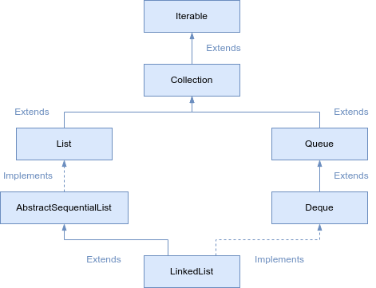

# LinkedList

The `LinkedList` class in Java implements the `List` and the `Deque` interface. Some of the salient features of a `LinkedList` are:

1. The elements are inserted in the order of insertion.
2. It supports duplicate elements.
3. We can add any number of null elements.



## Internal implementation of LinkedList
The `LinkedList` class has a static inner class called Node. This class contains three fields:
- `item` - This contains the value of the current element.
- `next` - This contains the pointer to the next element.
- `prev` - This contains the pointer to the previous element.

Below is the code for the `Node` class.

```java
private static class Node<E> {
    E item;
    Node<E> next;
    Node<E> prev;

    Node(Node<E> prev, E element, Node<E> next) {
        this.item = element;
        this.next = next;
        this.prev = prev;
    }
}
```

When an element is added to the `LinkedList`, a new `Node` instance is created. Depending on where the new node is being added, the **prev** and **next** fields are set.

When a node at index `i` is removed, the `next` field of node at index `i-1` is set to the node at index `i+1`. Similarly, the `prev` field of node at index `i+1` is set to node `i-1`.


## Time complexities for LinkedList operations

### Adding an element
The complexity of adding an element in a **LinkedList** is `O(1)`. If we need to search for the position where the `Node` needs to be inserted, then the complexity is `O(n)`, but the element is usually inserted at the beginning or end, which makes it `O(1)`.

The biggest benefit of `LinkedList`, in comparison to an array, is that in a `LinkedList`, in comparison to an array, is that when new elements are added or removed, the other elements are not rearranged.

### Removing an element
Removing an element is also an `O(1)` operation if we are aware of the position of the element that needs to be removed. If we need to search and remove an element, it is an `O(n)` operation.

### Searching an element
Searching an element is an `O(n)` operation, as the entire `LinkedList` is iterated to search the element in the worst case.

## Creating a LinkedList
There are two ways to create a `LinkedList`:

### Using the no-arg constructor
The default constructor does not take any argument and creates a `LinkedList` of size zero. Below is the syntax to create LinkedList using the default constructor.

```java
List<Integer> list = new LinkedList<Integer>();
```

### Using existing Collection
A `LinkedList` can also be created using an existing `Collection`. The newly created `LinkedList` will contain all the elements in the same order as the original `Collection`.

```java
List<Integer> list = new LinkedList<Integer>(oldList);
```

## Inserting an element into a LinkedList
Some of the methods used to insert an element into `LinkedList`.

### Inserting a single element at the end.
To insert a single element at the end, we can use the `add(E e)` or `addLast(E e)` method. These methods insert the given element at the end of the list and do not return anything.

### Inserting a single element at the beginning
We can use the `addFirst(E e)` method to insert an element at the beginning.

### Inserting an element at a particular index
We can use the `add(int index, E element)` method to insert an element at a particular index. The index should be greater than zero and less than the size of the `LinkedList`; otherwise, `IndexOutOfBoundsException` is thrown.

### Inserting multiple elements from another Collection
If we have a `Collection` and we need to add all its elements to another `LinkedList`, then the `addAll(Collection c)` method can be used. This method will add all the elements at the end of the `LinkedList`.

```java
list.addAll(anotherList)
```

### Inserting multiple elements from another Collection at a particular index
If we have a `Collection` and we need to add all its elements to another `LinkedList` at a particular index, then the `addAll(int index, Collection c)` method can be used. This method inserts all of the elements in the specified collection into this list starting at the specified position.

```java
list.addAll(3, anotherList)
```

```java
import java.util.ArrayList;
import java.util.LinkedList;
import java.util.List;

public class LinkedListDemo {

	public static void main(String args[]) {
		LinkedList<Integer> linkedList = new LinkedList<>();

		linkedList.add(1); // Adds 1 to the list.
		linkedList.add(2); // Adds 2 to the end of the list.
		linkedList.addLast(3); // Adds 3 to the end of the list.
		System.out.println(linkedList);

		linkedList.addFirst(10); // Adds 10 to the start of the list.
		System.out.println(linkedList);

		linkedList.add(2, 20); // Adds 20 to second position in the list.
		System.out.println(linkedList);

		List<Integer> list = new ArrayList<>();
		list.add(101);
		list.add(102);
		list.add(103);

		linkedList.addAll(3, list); // Adds the collection of elements at third position in the list.
		System.out.println(linkedList);
	}
}
```
```md
[1, 2, 3]
[10, 1, 2, 3]
[10, 1, 20, 2, 3]
[10, 1, 20, 101, 102, 103, 2, 3]
```

## LinkedList: Fetching and Removing

### Fetching the first element
We can use the `getFirst()` method to fetch the first element in the list. If the `LinkedList` is empty, then `NoSuchElementException` is thrown.

### Fetching the last element
We can use the `getLast()` method to fetch the last element in the list. If the `LinkedList` is empty, then `NoSuchElementException` is thrown.

### Fetching an element at a particular index
We can fetch an element at a particular index by using the `get(int index)` method. The index should be more than zero and less than the size of the `LinkedList`; otherwise, `IndexOutOfBoundsException` is thrown.

```java
import java.util.LinkedList;

public class LinkedListDemo {
	public static void main(String args[]) {
		LinkedList<Integer> linkedList = new LinkedList<>();
		linkedList.add(1);
		linkedList.add(2);
		linkedList.add(3);
		linkedList.add(4);
		linkedList.add(5);
		linkedList.add(6);

		System.out.println(linkedList.getFirst()); //Fetching the first element.
		System.out.println(linkedList.getLast()); //Fetching the last element.
		System.out.println(linkedList.get(2)); //Fetching the element at second index.
	}
}
```
```md
1
6
3
```

### Removing the first element
We can use the `removeFirst()` method to remove the first element in the list. If the `LinkedList` is empty, then `NoSuchElementException` is thrown.

### Removing the last element
We can use the `removeLast()` method to remove the last element in the list. If the `LinkedList` is empty, then `NoSuchElementException` is thrown.

### Removing an element at a particular index
We can remove an element at a particular index by using the `remove(int index)` method. The index should be more than zero and less than the size of the `LinkedList`; otherwise, `IndexOutOfBoundsException` is thrown.

## Removing a particular element
We can use the `remove(Object o)` method to remove a particular element from the `LinkedList`. If there is more than one occurrence of a particular element, then the first occurrence is removed. If we want to remove the last occurrence of an element, the `removeLastOccurrence()` method can be used.

```java
import java.util.LinkedList;

public class LinkedListDemo {
	public static void main(String args[]) {
		LinkedList<Integer> linkedList = new LinkedList<>();

		linkedList.add(1);
		linkedList.add(2);
		linkedList.add(3);
		linkedList.add(4);
		linkedList.add(2);
		linkedList.add(4);
		linkedList.add(5);
		System.out.println("LinkedList before removing any element " + linkedList);

		linkedList.remove(); //Removes the first element.
		System.out.println("LinkedList after removing first element " + linkedList);

		linkedList.removeLast(); //Removes the last element.
		System.out.println("LinkedList after removing last element " + linkedList);

		linkedList.remove(new Integer(2)); //Removes the first occurrence of 2.
		System.out.println("LinkedList after removing first occurrence of 2. " + linkedList);

		linkedList.removeLastOccurrence(new Integer(4)); //Removes the last occurrence of 4.
		System.out.println("LinkedList after removing the last occurrence of 4. " + linkedList);
	}
}
```
```md
LinkedList before removing any element [1, 2, 3, 4, 2, 4, 5]
LinkedList after removing first element [2, 3, 4, 2, 4, 5]
LinkedList after removing last element [2, 3, 4, 2, 4]
LinkedList after removing first occurrence of 2. [3, 4, 2, 4]
LinkedList after removing the last occurrence of 4. [3, 4, 2]
```

## Sorting a LinkedList

To sort a `LinkedList`, we can use the `sort()` method of the `Collections` class as shown in the example below.

```java
import java.util.Collections;
import java.util.LinkedList;

public class LinkedListDemo {

	public static void main(String args[]) {
		LinkedList<Integer> linkedList = new LinkedList<>();

		linkedList.add(20);
		linkedList.add(2);
		linkedList.add(12);
		linkedList.add(40);
		linkedList.add(76);
		linkedList.add(41);
		linkedList.add(53);

		Collections.sort(linkedList);

		System.out.println(linkedList);
	}
}
```
```md
[2, 12, 20, 40, 41, 53, 76]
```