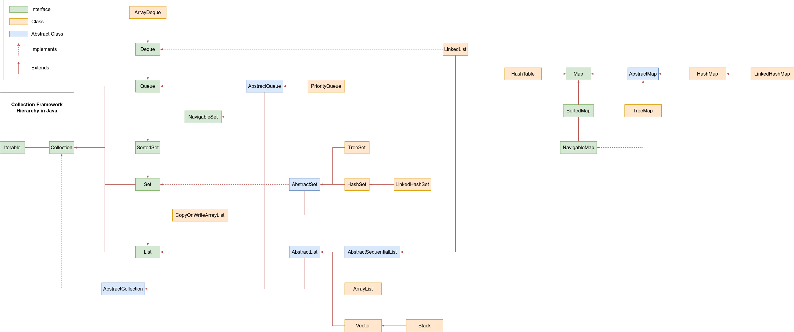
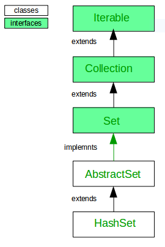

# `Set` Interface in Java

The `Set` interface present in the `java.util` package and extends the `Collection` interface is an unordered collection of objects in which duplicate values cannot be stored. It is an interface which implements the mathematical set. This interface contains the methods inherited from the `Collection` interface and adds a feature which restricts the insertion of the duplicate elements. There are two interfaces which extend the set implementation namely `SortedSet` and `NavigableSet`.



The `Set` interface is the sub-interface of `Collection` Interface. It is mainly implemented by 3 general-purpose classes namely:

- `TreeSet` - Mainly implements Red-Black Tree which is a self-balancing binary tree. Objects are stored in sorted order.
- `HashSet` - Implements Hashing for quick search, insertion and delete operations. The objects that we insert into the `HashSet` does not guarantee to be inserted in the same order.
- `LinkedHashSet` - Derived class of HashSet. Facilitates access of elements in insertion order.
- Abstract Classes like the provides a skeletal implementation of the `Collection` interface.
- Interface like `SortedSet` provides operations related to subset such as finding all the items greater or smaller than a given key or finding a subset in a given range
- Interface like `NavigableSet` provides navigable operations like floor, ceil, higher, lower etc.


**Declaration**: The `Set` interface is declared as:
```java
public interface Set extends Collection
```

Since `Set` is an interface, objects cannot be created of the typeset. We always need a class which extends this list in order to create an object. And also, after the introduction of Generics in Java 1.5, it is possible to restrict the type of object that can be stored in the `Set`. This type-safe set can be defined as:

```java
// Obj is the type of the object to be stored in Set
Set set = new HashSet ();
```

### Example 1:

```java
// Java program to demonstrate a Set
import java.util.*;

public class GfG {
    public static void main(String[] args) {
        // Set demonstration using HashSet
        Set<Integer> s = new HashSet<Integer>();

        // Adding elements to the Set
        s.add(10);
        s.add(20);
        s.add(30);

        // Duplicate element is skipped
        s.add(20);
        System.out.println(s);
    }
}
```
```md
Output:
[20, 10, 30]
```

> Note:
> - The order of the items is not defined in a `HashSet`.
> - The order of the items are maintained in a `TreeSet` in a sorted order. To do this it either uses a `Comparable` interface implemented by the class or a `Comparator` interface.


## When to prefer TreeSet over HashSet

- `TreeSet` uses a Red-Black tree algorithm underneath to sort out the elements. When one needs to perform read/write operations frequently, then `TreeSet` is a good choice.
- Sorted unique elements are required instead of unique elements. The sorted list given by `TreeSet` is always in ascending order.
- To implement operations like `ceil()`, `floor()`, `higher()`, `lower()`, we need to use a `TreeSet`.
- `TreeSet` can also implement a doubly ended queue and doubly ended priority queue for inserting or extracting max-min elements simultaneously. The `TreeSet` can perform all these operations in `O(log n)` time.
- `TreeSet` has greater locality than `HashSet`. If two entries are nearby in the order, then TreeSet places them near each other in data structure and hence in memory, while `HashSet` spreads the entries all over memory regardless of the keys they are associated to.
- `LinkedHashSet` is another data structure that is between these two. It provides time complexities like `HashSet` and maintains the order of insertion (Note that this is not sorted order, but the order in which elements are inserted).


### Interesting quick Operations:

Let 2 sets be,
```java
Set s1 = new HashSet();
Set s2 = new HashSet();
```

- For Union of these two Sets: `s1.addAll(s2)` : This is used to append all of the elements from the mentioned collection(`s2`) to the existing set(`s1`). The elements are added randomly without following any specific order.
- For Intersection of these two Sets: `s1.retainAll(s2)` : This is used to retain from this set(`s1`) all of its elements that are contained in the specified collection(`s2`).
- For the Difference between these two sets: `s1.removeAll(s2)` : This is used to remove from this set(`s1`) all of its elements that are contained in the specified collection(`s2`).
- Removing Duplicates from a Specific Collection using HashSet:
    `Set s = new HashSet();`

    For eg, to get an array(`arr`) with unique elements, the `Collection` `c` can be replaced by `Arrays.asList(arr)`. If this is implemented using a `TreeSet` then we can also get the elements in sorted order.

## HashSet in Java

The `HashSet` class implements the `Set` interface, backed by a hash table which is actually a `HashMap` instance. No guarantee is made as to the iteration order of the set which means that the class does not guarantee the constant order of elements over time. This class permits the `null` element. The class also offers constant time performance for the basic operations like add, remove, contains and size assuming the hash function disperses the elements properly among the buckets, which we shall see further in the article.

## Few important features of `HashSet` are:

- Implements Set Interface.
- Underlying data structure for `HashSet` is `HashTable`.
- As it implements the `Set` Interface, duplicate values are not allowed.
- Objects that you insert in `HashSet` are not guaranteed to be inserted in same order. Objects are inserted based on their hash code.
- `NULL` elements are allowed in `HashSet`.
- `HashSet` also implements `Searlizable` and `Cloneable` interfaces.




### Working of `add()`, `contains()` and `iterator()` function in `HashSet`

```java
// Java program to demonstrate
// working of HashSet
import java.util.*;

class Test {
    public static void main(String[]args) {
        HashSet<String> h = new HashSet<String>();

        // Adding keys into HashSet usind add()
        h.add("gfg");
        h.add("courses");
        h.add("ide");

        // Displaying the HashSet
        System.out.println(h);

        // Checks for key "ide"
        System.out.println(h.contains("ide"));

        // Iterating over hashset
        Iterator<String> i = h.iterator();
        while (i.hasNext())
            System.out.println(i.next() + " ");
    }
}
```
```md
Output:
[courses, gfg, ide]
true
courses
gfg
ide
```

### Method Description
- `add()`: Used to add the specified element if it is not present. If the element is already present then skip and return false.
- `contains()`: Used to return true if an element is present in set.
- `iterator()`: Used to return an iterator over the element in the set.

> NOTE: The HashSet follows a random order of traversal.

### Working of remove(), size() and isEmpty() function in HashSet

```java
// Java program to demonstrate
// working of HashSet
import java.util.*;

class Test {
    public static void main(String[] args) {
        HashSet<String> h = new HashSet<String>();

        // Adding keys into HashSet usind add()
        h.add("gfg");
        h.add("courses");
        h.add("ide");

        // Displaying the size of HashSet
        System.out.println(h.size());

        // Removing the key "ide"
        h.remove("ide");

        // Displaying the size of HashSet
        System.out.println(h.size());

        // Using for-each loop to traverse
        for(String s:h)
            System.out.print(s + " ");

        // Checking whether the set is empty or not
        System.out.println(h.isEmpty());
    }
}
```
```md
Output:
3
2
courses gfg
false
```

> NOTE: A size can also be defined for better optimization.

**Time Complexity**: The underlying data structure for `HashSet` is `HashTable`. So amortize (average or usual case) time complexity for `add()`, `remove()` and `contains()` method operation of `HashSet` takes `O(1)` time. The `size()` and `isEmpty()` takes `O(1)` time in worst case.